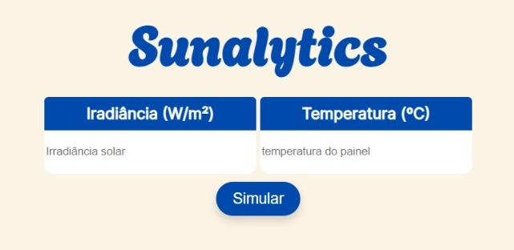
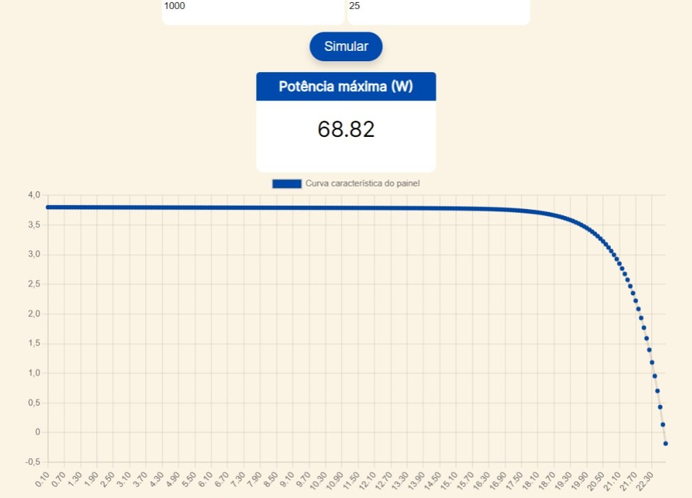

# sunalytics :sun_with_face:

## objetivo
Este projeto consiste em um simulador web que permite aos usuários inserir valores de irradiância solar  e temperatura do painel fotovoltaico. Com base nesses parâmetros, o simulador calcula e exibe a potência máxima de um painel predefinido nessas condições específicas. Além disso, a curva característica (gráfico a corrente pela tensão) também é exibido.

## design

    
## melhorias futuras
Atualmente, o simulador é projetado para calcular a potência máxima de um painel fotovoltaico específico com base em parâmetros predefinidos. No entanto, é possível expandir o escopo do simulador, tornando-o adaptável a diferentes tipos de painéis solares, desde que o usuário inserisse uma série de parâmetros referentes ao seu painel.
